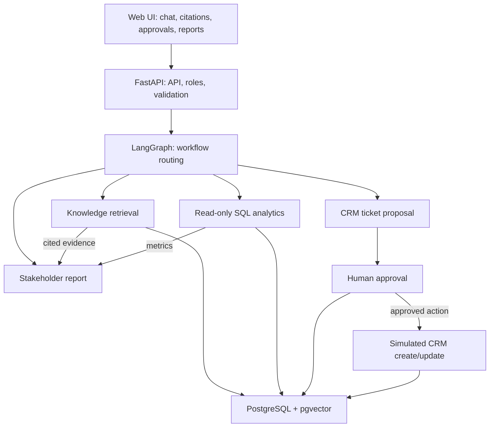

# Enterprise_AI_Operations_Pilot
A secure, permission-aware AI operations copilot for enterprise knowledge search, read-only analytics, and human-approved CRM actions.

## Architecture



Knowledge retrieval uses authorized documents, and analytics queries use approved read-only views. Ticket details are validated before approval; if they change afterward, the action requires reapproval. Requests, decisions, executions, and outcomes are recorded in the audit log.

## Project Structure

```text
frontend/       Minimal chat and approval interface
backend/        FastAPI API, LangGraph workflows, RAG, and approvals
mcp_server/     Analytics and CRM MCP tools
data/           Sample documents and analytics data
tests/           Unit and security tests
docs/            Architecture documentation
